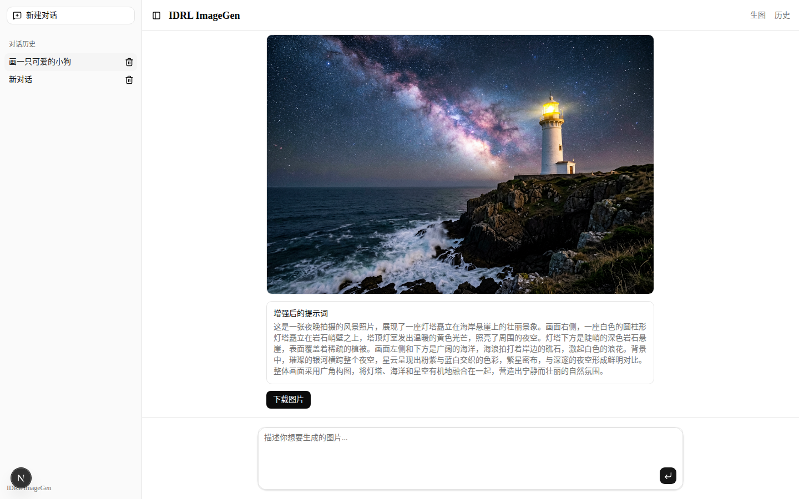
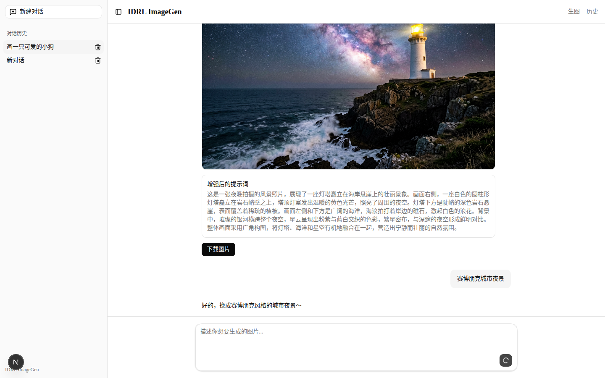
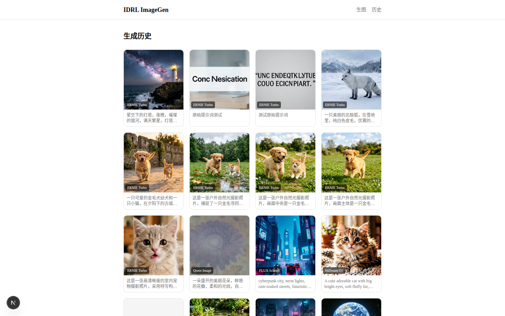

<div align="center">

# IDRL ImageGen

**AI-Powered Image Generation with Conversational Interface**

[](https://opensource.org/licenses/MIT)
[](https://nextjs.org/)
[](https://github.com/comfyanonymous/ComfyUI)

[English](#features) · [快速开始](#quick-start) · [架构](#architecture) · [配置](#configuration)

</div>

---

IDRL ImageGen 是一个开箱即用的 AI 图片生成服务。通过自然语言对话描述你想要的图片，系统会自动优化提示词并调用 ComfyUI 生成高质量图片。支持多种扩散模型、提示词增强、对话持久化，适合快速搭建生图服务或作为 ComfyUI 的前端界面。

## Screenshots

<table>
  <tr>
    <td align="center"><b>Chat Interface</b></td>
    <td align="center"><b>Generation Confirm</b></td>
  </tr>
  <tr>
    <td></td>
    <td></td>
  </tr>
  <tr>
    <td align="center" colspan="2"><b>Generation History</b></td>
  </tr>
  <tr>
    <td align="center" colspan="2"></td>
  </tr>
</table>

## Features

- **Conversational Image Generation** — Describe what you want in natural language, AI refines your prompt and generates images
- **Multi-Model Support** — ERNIE Turbo, FLUX Schnell, HiDream O1, Qwen Image out of the box
- **Prompt Enhancement** — One-click prompt optimization for more detailed, vivid descriptions
- **Generation History** — Browse all past generations with original & enhanced prompts
- **Conversation Persistence** — Server-side SQLite storage, conversations survive browser restarts
- **Async Job Queue** — BullMQ + Redis handles long-running generation tasks reliably
- **Editable Parameters** — Adjust model, size, and enhanced prompt before confirming generation
- **Model Switching** — Change model on-the-fly, each with optimized ComfyUI workflows

## Tech Stack

| Layer | Technology |
|---|---|
| Frontend | [Next.js 16](https://nextjs.org/), [React 19](https://react.dev/), [Tailwind CSS 4](https://tailwindcss.com/), [shadcn/ui](https://ui.shadcn.com/) |
| AI Chat | [Vercel AI SDK 6](https://sdk.vercel.ai/) (OpenAI-compatible API) |
| Job Queue | [BullMQ](https://bullmq.io/), [Redis](https://redis.io/) |
| Database | [SQLite](https://www.sqlite.org/) (better-sqlite3, WAL mode) |
| Image Generation | [ComfyUI](https://github.com/comfyanonymous/ComfyUI) (API-based workflow execution) |

## Architecture

```
┌─────────────┐     ┌──────────────┐     ┌──────────┐
│  Browser    │────▶│  Next.js     │────▶│  Redis   │
│  (Chat UI)  │     │  (API Routes)│     │  (Queue) │
└─────────────┘     └──────┬───────┘     └────┬─────┘
                           │                   │
                    ┌──────▼───────┐    ┌──────▼─────┐
                    │   SQLite     │    │   Worker   │
                    │ (Conversations│    │  (BullMQ)  │
                    │   & Tasks)   │    └──────┬─────┘
                    └──────────────┘           │
                                         ┌─────▼──────┐
                                         │  ComfyUI   │
                                         │ (GPU Server)│
                                         └────────────┘
```

The system runs as two independent processes:

- **Next.js** — Web server handling API routes, SSR, and static assets
- **Worker** — Consumes jobs from the Redis queue, executes ComfyUI workflows, stores results

## Quick Start

### Prerequisites

- Node.js >= 18
- Redis server
- [ComfyUI](https://github.com/comfyanonymous/ComfyUI) with models installed and workflows configured

### Installation

```bash
git clone https://github.com/zweien/idrl-imagegen.git
cd idrl-imagegen
npm install
```

### Configuration

Create `.env.local` in the project root:

```bash
cp .env.example .env.local
```

```env
# ComfyUI server (must be accessible from the machine running the worker)
COMFYUI_URL=http://your-gpu-server:8189

# Redis (used by BullMQ for job queue)
REDIS_URL=redis://localhost:6379

# AI Chat API (any OpenAI-compatible endpoint)
OPENAI_BASE_URL=http://your-llm-endpoint/v1
OPENAI_API_KEY=sk-your-api-key
OPENAI_MODEL=your-model-name
```

### Run

```bash
# Terminal 1: Start the web server
npm run dev

# Terminal 2: Start the background worker
npm run worker
```

Open http://localhost:9560 and start generating images!

### Production

```bash
npm run build
npm start        # Web server
npm run worker   # Background worker (separate process)
```

## Supported Models

| Model | Steps | Prompt Enhancement | Description |
|-------|-------|-------------------|-------------|
| ERNIE Turbo | 8 | ✅ | Fast generation with prompt enhancement |
| FLUX Schnell | 4 | — | Ultra-fast generation |
| HiDream O1 | 28 | — | High-quality output |
| Qwen Image | 20 | — | Balanced quality and speed |

> Adding a new model requires a ComfyUI workflow JSON file and a few lines of config — see [`src/lib/types.ts`](src/lib/types.ts) and [`src/lib/workflow-builder.ts`](src/lib/workflow-builder.ts).

## Project Structure

```
src/
├── app/
│   ├── api/
│   │   ├── chat/              # AI chat endpoint (streaming)
│   │   ├── conversations/     # Conversation CRUD
│   │   ├── enhance-prompt/    # Prompt enhancement
│   │   ├── generate/          # Submit generation task
│   │   └── tasks/             # Query task status
│   ├── history/               # Generation history page
│   └── page.tsx               # Main chat page
├── components/
│   ├── ai-elements/           # Chat UI primitives
│   ├── ui/                    # shadcn/ui base components
│   ├── chat-sidebar.tsx       # Conversation list sidebar
│   ├── generation-confirm.tsx # Confirm card (model/size/enhancement)
│   └── generation-message.tsx # Generation status display
├── lib/
│   ├── comfyui.ts             # ComfyUI API client
│   ├── conversation-store.ts  # Conversation persistence
│   ├── db.ts                  # SQLite database layer
│   ├── queue.ts               # BullMQ queue setup
│   ├── types.ts               # Model configs & types
│   └── workflow-builder.ts    # Per-model workflow builder
└── worker/
    ├── image-worker.ts        # Image generation worker
    └── start.ts               # Standalone worker entry point
```

## How It Works

1. **User sends a message** — e.g. "a cat on the moon"
2. **AI chat processes the request** — understands the intent, generates an optimized prompt, and returns a tool call with generation parameters
3. **User reviews and confirms** — the confirm card shows the optimized prompt, allows switching models, sizes, and optional prompt enhancement
4. **Task queued to Redis** — the generation job is submitted to BullMQ
5. **Worker picks up the job** — builds a ComfyUI workflow, submits it, polls for completion
6. **Image stored and displayed** — the generated image is saved locally and shown in the chat

## Contributing

Contributions are welcome! Feel free to:

- Open an [Issue](https://github.com/zweien/idrl-imagegen/issues) for bugs or feature requests
- Submit a [Pull Request](https://github.com/zweien/idrl-imagegen/pulls) with improvements

## License

[MIT](LICENSE) © IDRL
